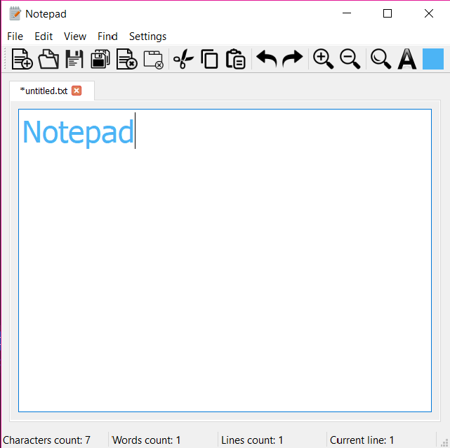

# Simple Notepad
This is a simple text editor written in C++ with Qt framework. It allows user to perform basic operations on text files. 

## Features
- editing text 
- basic notepad operations (like "Select All" or "Copy" and "Paste")
- changing editor's font and color
- finding all occurances of a certain phrase

## Releases
[All releases](https://github.com/martalech/Simple-Notepad/releases)

## About Project
Written with Visual Studio 2017 using Qt plugin.
Compiled with Qt 5.11.1.
